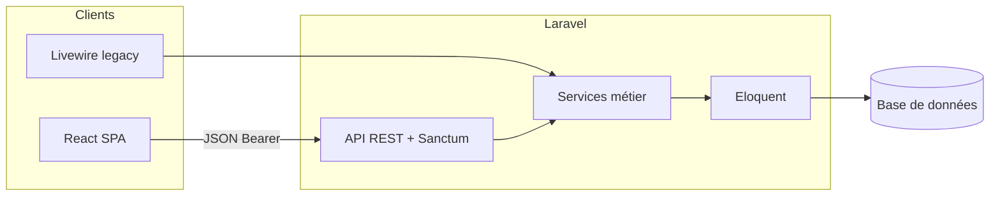

# Transformez l'architecture d'une application existante

Projet **Renote** : prise de notes, relations entre notes et tags — évolution progressive d’un monolithe Laravel + Livewire vers une exposition **API REST** et un front **React** avec **state management**.

## Sommaire

- [Contexte produit](#contexte-produit)
- [Architecture cible (synthèse)](#architecture-cible-synthèse)
  - [Description](#description)
  - [Justification](#justification)
- [Documentation détaillée](#documentation-détaillée)
- [Installation](#installation)

---

## Contexte produit

Renote permet à un utilisateur de :

- créer et consulter des notes ;
- définir des relations entre les notes ;
- gérer des tags et les associer à des notes.

---

## Architecture cible (synthèse)

### Description

L’architecture **cible** est un **monolithe Laravel évolutif** :

| Couche | Rôle |
|--------|------|
| **Back-end** | Une seule application Laravel expose une **API REST** documentée (`routes/api.php`, contrôleurs JSON) et conserve la **logique métier** dans des **services** (`NoteService`, `TagService`, etc.) partagés avec l’UI historique. L’authentification API repose sur **Laravel Sanctum** (tokens Bearer). |
| **Front historique** | Pages **Blade + Livewire** peuvent coexister le temps de la migration, mais le périmètre notes/tags vise une **SPA React** montée depuis une vue « coquille ». |
| **Front cible** | **React** + **bundler (Vite)** consommant **uniquement** l’API (`/api/...`) en JSON ; **state management** centralisé (ex. **Redux Toolkit**) pour auth, listes notes/tags et erreurs ; plus de dépendance à la session Livewire pour ce flux. |

Schéma d’ensemble (vue logique) :



### Justification

- **Une seule source de vérité métier** : les règles restent dans les services Laravel ; l’API et Livewire (transitoire) s’appuient sur les mêmes primitives → pas de duplication incompatible entre « web » et « API ».
- **Clients interchangeables** : contrat HTTP stable (JSON + OpenAPI implicite dans les contrôleurs) permet d’ajouter un front React, puis éventuellement mobile ou autre consommateur sans réécrire le cœur métier.
- **Séparation nette présentation / données** : React gère l’état UI et les appels réseau ; le serveur reste autorité sur persistance et validation métier → aligné avec l’objectif du parcours « transformer l’architecture existante » sans big-bang.
- **Auth explicite côté API** : Sanctum + Bearer clarifie le modèle pour un client hors session cookie, condition nécessaire à une SPA isolée ou servie sur un autre origine si le projet l’exige.

---

## Documentation détaillée

| Document | Contenu |
|----------|---------|
| [docs/architecture-backend-etape4.md](docs/architecture-backend-etape4.md) | Évolution back-end, services, API REST |
| [docs/architecture-front-exercice2-etape1.md](docs/architecture-front-exercice2-etape1.md) | Analyse du front actuel et écart vers la cible |
| [docs/architecture-front-exercice2-etape2.md](docs/architecture-front-exercice2-etape2.md) | Front cible : Redux Toolkit et flux de données |

---

## Installation

1. **Laravel Herd** (PHP, Composer, environnement local) : [documentation Laravel — Herd](https://laravel.com/docs/12.x/installation#installation-using-herd)

2. **Node.js** (v22 recommandé) — gestionnaire de versions : **nvm** (macOS/Linux) ; sous Windows : [nvm-windows](https://github.com/coreybutler/nvm-windows#readme)

3. **Cloner** ce dépôt, puis à la racine du projet :

   ```bash
   composer install
   npm install
   ```

4. **Environnement** : copier `.env.example` en `.env`, puis `php artisan key:generate`.

5. **Base de données** : adapter `.env` (SQLite par défaut dans l’exemple), puis :

   ```bash
   php artisan migrate
   ```

6. **Assets front** :

   - développement : `npm run dev` ;
   - ou build de production : `npm run build` (génère `public/build/manifest.json` requis si le serveur Vite n’est pas lancé).

7. **Démarrer Herd** et ouvrir l’URL du site dans le navigateur.

Vous êtes prêt à travailler sur le projet.
