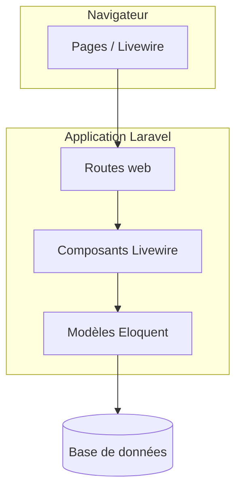
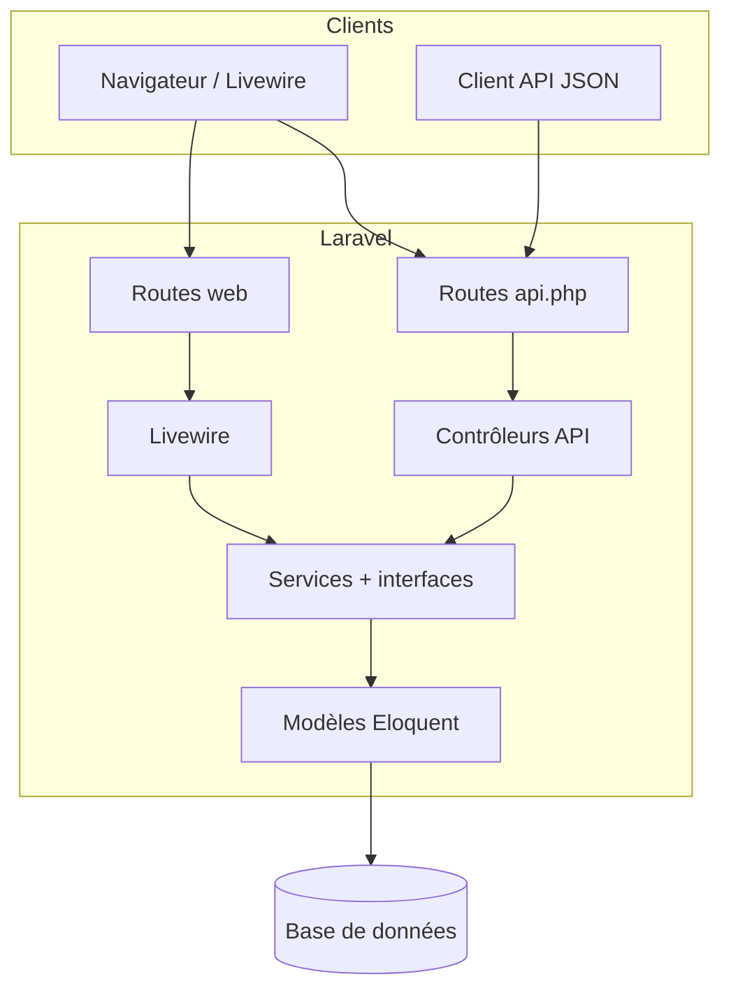

# Document d’architecture — back-end (Étape 4)

Objectif : décrire l’évolution du back-end et l’API REST, de façon **simple** et alignée sur le code actuel.

---

## 1. Analyse de l’architecture initiale

Au départ, l’application type **Laravel + Livewire** fonctionnait ainsi :

- Les **routes web** (`routes/web.php`) pointaient vers des pages ou des composants Livewire.
- La **logique métier** et les requêtes **Eloquent** étaient souvent directement dans les composants Livewire (couplage fort interface / données).
- **Pas d’API REST** dédiée : pas de contrôleurs JSON ni d’authentification par token pour un client externe.

Limite principale : difficile de réutiliser la même logique pour une appli mobile ou un front séparé sans dupliquer le code.

---

## 2. Schéma simplifié — architecture de base (avant)

---

## 3. Schéma — architecture back-end refactorisée (actuelle)

**Choix technique (1–2 phrases)** : les **Services** (`NoteService`, `TagService`) centralisent listes / créations / suppressions. On n’a pas ajouté une couche **Repository** séparée pour rester simple sur un périmètre CRUD réduit ; les services appellent directement les modèles Eloquent.

---

## 4. Rôle des couches (routes, contrôleurs, « accès données »)

| Couche | Rôle |
|--------|------|
| **Routes** (`web.php`, `api.php`) | Déclarent les URL, le middleware (`auth`, `auth:sanctum`) et le contrôleur ou la vue cible. |
| **Contrôleurs API** | Reçoivent la requête HTTP, **valident** les entrées, appellent un service, renvoient du **JSON**. |
| **Composants Livewire** | Gèrent l’interface web ; appellent les **mêmes** services que l’API (pas de duplication de règles). |
| **Services (+ contrats)** | Règles métier et accès données orchestré autour des modèles (équivalent pratique d’une couche « repository + use case » allégée). |
| **Modèles** | Mapping tables, relations, attributs remplissables. |

---

## 5. Définition de l’API REST

**Authentification** : **Laravel Sanctum** — après login, envoyer l’en-tête `Authorization: Bearer <token>`.

| Méthode | URL | Auth | Description |
|---------|-----|------|-------------|
| `POST` | `/api/login` | Non | Corps JSON : `email`, `password`. Réponse : `token`, `token_type`, `user`. |
| `POST` | `/api/logout` | Oui | Révoque le token courant. |
| `GET` | `/api/user` | Oui | Profil minimal de l’utilisateur connecté. |
| `GET` | `/api/notes` | Oui | Liste des notes de l’utilisateur (avec tag). |
| `POST` | `/api/notes` | Oui | Corps : `text`, `tag_id`. Crée une note. |
| `DELETE` | `/api/notes/{id}` | Oui | Supprime une note de l’utilisateur (`id` numérique). |
| `GET` | `/api/tags` | Oui | Liste des tags. |
| `POST` | `/api/tags` | Oui | Corps : `name`. Crée un tag. |

**Codes utiles** : `201` création, `204` suppression sans corps, erreurs de validation en `422`, non authentifié en `401`.

---

## 6. Points de vigilance (rappel consigne)

- Les schémas ci-dessus correspondent à la structure **routes → Livewire ou contrôleurs API → services → modèles**.
- La consigne OpenClassrooms cite parfois les **repositories** : ici le rôle « accès structuré aux données » est assumé par les **services** pour limiter la complexité.

Pour les diagrammes « présentables », vous pouvez recopier les schémas **Mermaid** dans [draw.io](https://app.diagrams.net/) ou les exporter depuis un outil compatible.
