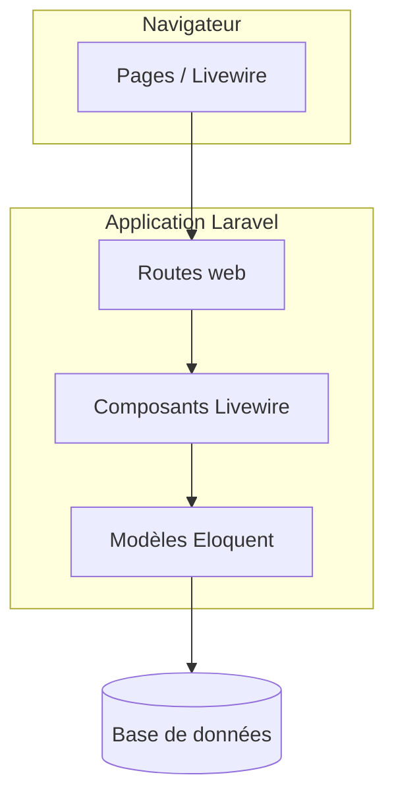
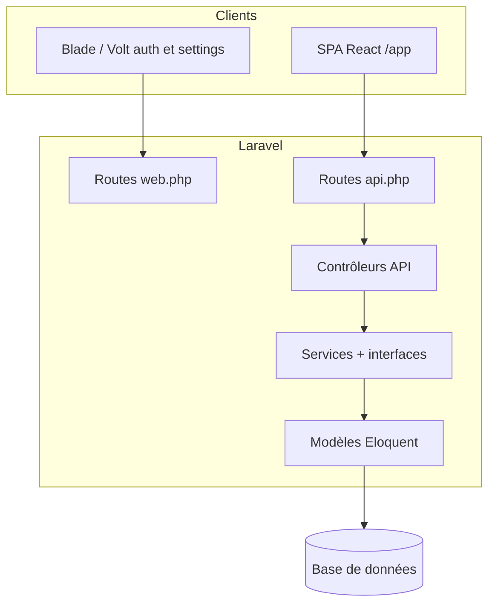

# Document d’architecture — back-end (Exercice 1 - Étape 4)

Objectif : décrire l’évolution du back-end et l’API REST, de façon **simple** et alignée sur le code actuel.

**Synthèse finale (étape OC 4)** — schémas globaux, catalogue API avec **exemples JSON**, SOLID, séquence front → BDD : **[architecture-etape4-finale.md](architecture-etape4-finale.md)**.

## Sommaire

- [Architecture cible (back-end) et justification](#architecture-cible-back-end-et-justification)
- [1. Analyse de l’architecture initiale](#1-analyse-de-larchitecture-initiale)
- [2. Schéma simplifié — architecture de base (avant)](#2-schéma-simplifié--architecture-de-base-avant)
- [3. Schéma — architecture back-end refactorisée (actuelle)](#3-schéma--architecture-back-end-refactorisée-actuelle)
- [4. Rôle des couches (routes, contrôleurs, « accès données »)](#4-rôle-des-couches-routes-contrôleurs-accès-données)
- [5. Définition de l’API REST](#5-définition-de-lapi-rest)

---

## Architecture cible (back-end) et justification

### Description

L’architecture **cible** côté serveur pour ce parcours est un **monolithe Laravel structuré en couches** :

- une **API REST** (`routes/api.php`, contrôleurs dédiés, réponses JSON) pour tout client externe au cycle requête/réponse « page web classique » ;
- des **services applicatifs** (`NoteService`, `TagService`, interfaces) qui concentrent la logique CRUD et les règles d’accès par utilisateur ;
- les **modèles Eloquent** pour le mapping relationnel, appelés **depuis les services** (pas de logique métier dispersée dans les contrôleurs) ;
- l’**authentification API** via **Laravel Sanctum** (tokens Bearer) pour la SPA React ; l’auth web par session sert encore **login/register/settings** (Volt / Blade).

Cette cible **n’impose pas** une couche Repository séparée : le périmètre métier reste limité ; les services jouent le rôle d’orchestrateurs et gardent le code lisible sans sur-ingénierie.

### Justification

| Choix | Raison |
|-------|--------|
| **API + services partagés** | Un client React, un futur mobile ou un outil scripté consomment la **même** logique que l’UI historique → pas de divergence de comportement entre canaux. |
| **Sanctum / tokens** | Les SPA et les clients non-navigateur ne s’appuient pas naturellement sur les cookies de session comme Livewire ; un contrat Bearer est explicite et contrôlable. |
| **Pas de microservices à ce stade** | Le gains principal du projet est la **clarification des frontières** (HTTP JSON, services) dans un déploiement unique — coût et complexité maîtrisés pour un périmètre CRUD. |
| **Services sans Repository obligatoire** | Réduit la verbosité tant que les requêtes restent simples ; on peut introduire des repositories plus tard si les accès données se complexifient. |

Pour la vision **complète** (front React + state management), voir aussi le [README](../README.md) et les documents front [architecture-front-exercice2-etape1.md](architecture-front-exercice2-etape1.md), [architecture-front-exercice2-etape2.md](architecture-front-exercice2-etape2.md).

---

## 1. Analyse de l’architecture initiale

Au départ, l’application type **Laravel + Livewire** fonctionnait ainsi :

- Les **routes web** (`routes/web.php`) pointaient vers des pages ou des composants Livewire.
- La **logique métier** et les requêtes **Eloquent** étaient souvent directement dans les composants Livewire (couplage fort interface / données).
- **Pas d’API REST** dédiée : pas de contrôleurs JSON ni d’authentification par token pour un client externe.

Limite principale : difficile de réutiliser la même logique pour une appli mobile ou un front séparé sans dupliquer le code.

---

## 2. Schéma simplifié — architecture de base (avant)

---

## 3. Schéma — architecture back-end refactorisée (actuelle)

> Le périmètre **notes / tags** côté navigateur passe par la **SPA React** (`/app`) qui consomme uniquement **`routes/api.php`** ; le **dashboard Blade** et les **écrans Volt** (profil, auth) utilisent **`routes/web.php`**. Les composants Livewire **Notes / TagForm** ont été retirés du dépôt.

**Choix technique (1–2 phrases)** : les **Services** (`NoteService`, `TagService`) centralisent listes / créations / suppressions. On n’a pas ajouté une couche **Repository** séparée pour rester simple sur un périmètre CRUD réduit ; les services appellent directement les modèles Eloquent.

---

## 4. Rôle des couches (routes, contrôleurs, « accès données »)

| Couche | Rôle |
|--------|------|
| **Routes** (`web.php`, `api.php`) | Déclarent les URL, le middleware (`auth`, `auth:sanctum`) et le contrôleur ou la vue cible. |
| **Contrôleurs API** | Reçoivent la requête HTTP, **valident** les entrées, appellent un service, renvoient du **JSON**. |
| **Vues Blade / Volt** | Auth, réglages utilisateur, dashboard « pont » vers la SPA — **sans** composants Livewire notes/tags (supprimés). |
| **Services (+ contrats)** | Règles métier et accès données orchestré autour des modèles (ex. `NoteService::deleteForUser` vérifie `user_id` avant suppression). |
| **Modèles** | Mapping tables, relations, attributs remplissables. |

---

## 5. Définition de l’API REST

**Authentification** : **Laravel Sanctum** — après login, envoyer l’en-tête `Authorization: Bearer <token>`.

| Méthode | URL | Auth | Description |
|---------|-----|------|-------------|
| `POST` | `/api/login` | Non | Corps JSON : `email`, `password`. Réponse : `token`, `token_type`, `user`. |
| `POST` | `/api/logout` | Oui | Révoque le token courant. |
| `GET` | `/api/user` | Oui | Profil minimal de l’utilisateur connecté. |
| `GET` | `/api/notes` | Oui | Liste des notes de l’utilisateur (avec tag). |
| `POST` | `/api/notes` | Oui | Corps : `text`, `tag_id`. Crée une note. |
| `DELETE` | `/api/notes/{id}` | Oui | Supprime une note de l’utilisateur (`id` numérique). |
| `GET` | `/api/tags` | Oui | Liste des tags. |
| `POST` | `/api/tags` | Oui | Corps : `name`. Crée un tag. |

**Codes utiles** : `201` création, `204` suppression sans corps, erreurs de validation en `422`, non authentifié en `401`.

**Exemples de corps JSON** (réponses typiques, erreurs `422`) : voir le catalogue détaillé dans **[architecture-etape4-finale.md](architecture-etape4-finale.md)** § 4.
