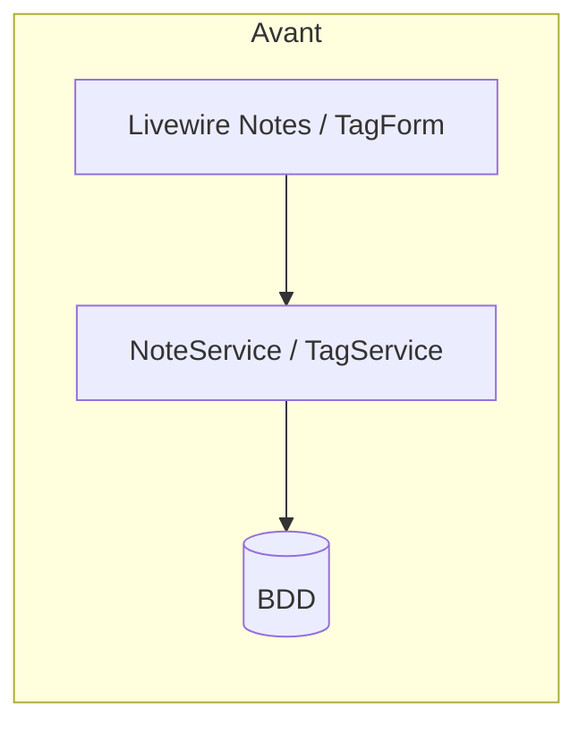
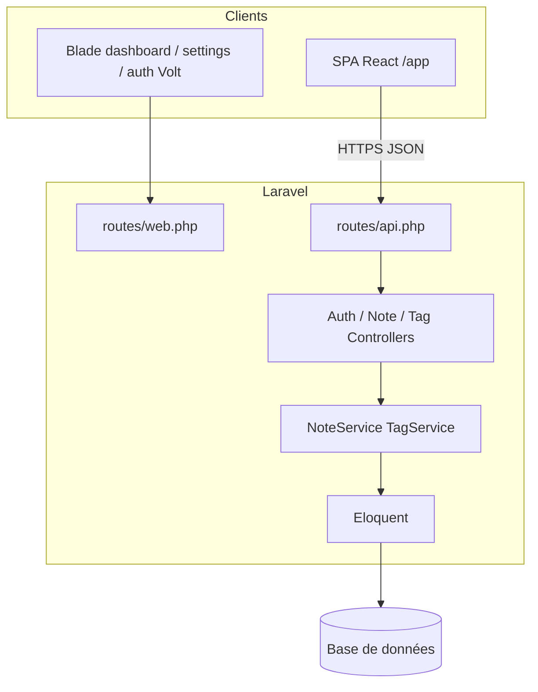
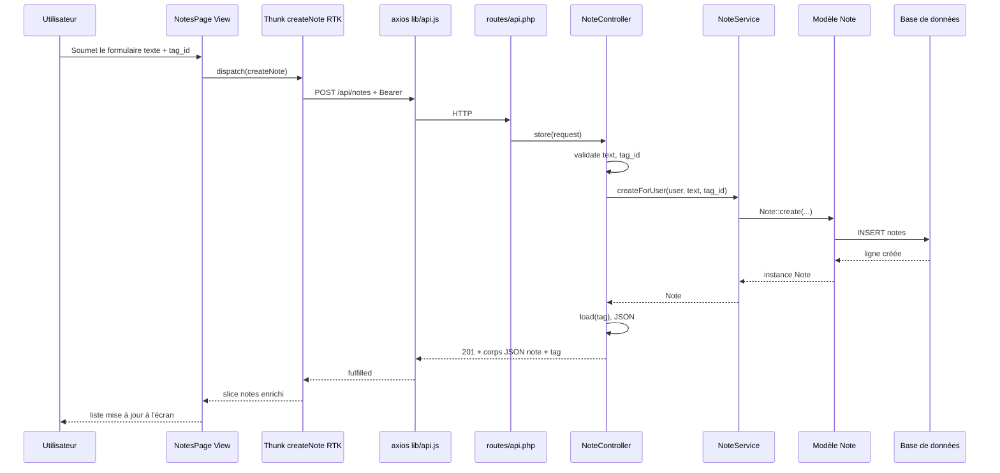

# Architecture — synthèse finale (Étape 4)

Document unique pour **relier le front React state-driven et le back Laravel (MVC + services)** : schémas, couches, catalogue API avec exemples JSON, principes SOLID, parcours requête front → BDD.

**Documents liés** : [architecture-backend-etape4.md](architecture-backend-etape4.md) (détail back / évolution), [architecture-front-exercice2-etape2.md](architecture-front-exercice2-etape2.md) (Redux Toolkit), [README](../README.md) (installation, sécurité SPA).

---

## Sommaire

- [1. Vue d’ensemble : base vs cible](#1-vue-densemble--base-vs-cible)
- [2. Couches back-end (routes → contrôleurs → services → modèles)](#2-couches-back-end-routes--contrôleurs--services--modèles)
- [3. Couches front-end (View / « ViewModel » / Model côté client)](#3-couches-front-end-view--viewmodel--model-côté-client)
- [4. Endpoints REST : catalogue et exemples JSON](#4-endpoints-rest--catalogue-et-exemples-json)
- [5. Endpoints consommés par la SPA React](#5-endpoints-consommés-par-la-spa-react)
- [6. Principes SOLID et séparation des responsabilités](#6-principes-solid-et-séparation-des-responsabilités)
- [7. Schéma séquentiel : une requête du front jusqu’à la réponse JSON](#7-schéma-séquentiel--une-requête-du-front-jusquà-la-réponse-json)

---

## 1. Vue d’ensemble : base vs cible

### 1.1 Architecture de base (avant refactor notes/tags)

Le périmètre **notes / tags** passait par **Livewire** et la session web ; pas de client API unique pour le navigateur.



### 1.2 Architecture cible **réalisée** (état du dépôt)

- **Back** : `routes/api.php` → contrôleurs `App\Http\Controllers\Api\*` → **`NoteService` / `TagService`** (interfaces injectées) → **Eloquent** → SQLite (ou autre driver `.env`).
- **Front** : **`resources/views/spa.blade.php`** charge Vite → **`app.jsx`** → **React Router** (`/app`) → pages → **Redux Toolkit** (thunks) → **`lib/api.js`** (axios `baseURL: '/api'`, Bearer Sanctum).



Les composants **Livewire Notes / TagForm ont été retirés** ; `/notes` et `/tags` (web) **redirigent** vers `/app/notes` et `/app/tags`.

---

## 2. Couches back-end (routes → contrôleurs → services → modèles)

| Couche | Fichiers / rôle concret |
|--------|-------------------------|
| **Routes** | `routes/api.php` : préfixe `/api`, groupe `auth:sanctum` sauf `POST /login`. Déclenche le bon contrôleur + middleware. |
| **Contrôleurs API** | `AuthController`, `NoteController`, `TagController` : **validation** des entrées (`$request->validate`), **aucune règle métier** ; appellent l’interface injectée (`NoteServiceInterface::createForUser(...)`) ; **réponses JSON** (`201`, `204`, `422`). |
| **Services** | `NoteService`, `TagService` : **une responsabilité domaine** (ex. `listForUser` filtre `where user_id`) ; implémentent les **contrats** dans `App\Contracts\`. |
| **Modèles** | `Note`, `Tag`, `User` : `$fillable`, relations `belongsTo` / `hasMany` ; **pas de logique HTTP**. |

**Exemple concret** : créer une note utilisateur 3 avec texte « Réunion » et `tag_id` 2 → `NoteController::store` valide → `NoteService::createForUser` fait `Note::create(['user_id' => 3, 'tag_id' => 2, 'text' => 'Réunion'])`.

---

## 3. Couches front-end (View / « ViewModel » / Model côté client)

OpenClassroom cite souvent **View / ViewModel / Model**. Dans ce projet React + Redux :

| Couche OC | Équivalent projet | Rôle |
|-----------|-------------------|------|
| **View** | Composants **`pages/*.jsx`**, **`layouts/AppShell.jsx`** | Affichage JSX, événements utilisateur (`onSubmit`, `onClick`). Pas d’appel HTTP direct dans l’idéal : `dispatch(thunk)`. |
| **ViewModel** (logique de présentation / état écran) | **Slices Redux** + **`createAsyncThunk`** (`features/auth`, `notes`, `tags`) + **`useAppSelector`** | Prépare l’état pour la View (liste chargée, erreurs `422`, utilisateur connecté). Orchestre les appels via **`lib/api.js`**. |
| **Model** (côté client) | **Objets JSON** renvoyés par l’API (`user`, `note` avec `tag` imbriqué, `tag`) | Forme des données **échangées** ; la **vérité métier persistée** reste côté serveur (Eloquent). |

Le **client HTTP** (`axios`, en-tête `Authorization: Bearer`) est le **pont** entre ViewModel (thunks) et les contrôleurs Laravel.

---

## 4. Endpoints REST : catalogue et exemples JSON

**Auth** : après `POST /api/login`, toutes les routes ci-dessous (sauf login) exigent :

`Authorization: Bearer <token_plain_text>`

| Méthode | URL | Auth | Description |
|---------|-----|------|--------------|
| `POST` | `/api/login` | Non | Corps : `email`, `password`, optionnel `device_name`. |
| `POST` | `/api/logout` | Oui | Révoque le token courant. |
| `GET` | `/api/user` | Oui | Profil utilisateur minimal. |
| `GET` | `/api/notes` | Oui | Liste des notes **de l’utilisateur**, relation `tag` chargée. |
| `POST` | `/api/notes` | Oui | Corps : `text`, `tag_id` (existant en `tags`). |
| `DELETE` | `/api/notes/{id}` | Oui | Supprime si la note appartient à l’utilisateur. |
| `GET` | `/api/tags` | Oui | Liste des tags. |
| `POST` | `/api/tags` | Oui | Corps : `name` (unique, max 50). |

### Exemples de corps / réponses (alignés sur les contrôleurs)

**`POST /api/login`** — requête :

```json
{ "email": "user@example.com", "password": "secret", "device_name": "react-spa" }
```

**`POST /api/login`** — réponse `200` :

```json
{
  "token": "1|abcdefghijklmnopqrstuvwxyz1234567890",
  "token_type": "Bearer",
  "user": { "id": 1, "name": "Alex", "email": "user@example.com" }
}
```

**`GET /api/user`** — réponse `200` :

```json
{ "id": 1, "name": "Alex", "email": "user@example.com" }
```

**`GET /api/notes`** — extrait de réponse `200` (tableau) :

```json
[
  {
    "id": 4,
    "user_id": 1,
    "tag_id": 2,
    "text": "Acheter du lait",
    "created_at": "2026-04-20T10:00:00.000000Z",
    "updated_at": "2026-04-20T10:00:00.000000Z",
    "tag": { "id": 2, "name": "Courses", "created_at": "...", "updated_at": "..." }
  }
]
```

**`POST /api/notes`** — requête :

```json
{ "text": "Nouvelle idée", "tag_id": 2 }
```

**`POST /api/notes`** — réponse `201` (note + relation `tag` chargée) :

```json
{
  "id": 5,
  "user_id": 1,
  "tag_id": 2,
  "text": "Nouvelle idée",
  "created_at": "2026-04-20T12:00:00.000000Z",
  "updated_at": "2026-04-20T12:00:00.000000Z",
  "tag": { "id": 2, "name": "Courses", "created_at": "...", "updated_at": "..." }
}
```

**`DELETE /api/notes/5`** — réponse `204` sans corps.

**`GET /api/tags`** — réponse `200` :

```json
[
  { "id": 1, "name": "Travail", "created_at": "...", "updated_at": "..." },
  { "id": 2, "name": "Courses", "created_at": "...", "updated_at": "..." }
]
```

**`POST /api/tags`** — requête :

```json
{ "name": "Urgent" }
```

**Erreur validation `422`** (ex. nom de tag déjà pris) :

```json
{
  "message": "The name has already been taken.",
  "errors": {
    "name": ["The name has already been taken."]
  }
}
```

**Tests** : à valider avec **Postman** / Insomnia / Thunder Client sur la même base que l’app (`Authorization` Bearer après login). Les tests automatisés PHPUnit du projet couvrent surtout l’auth web et les settings, pas chaque endpoint API — la validation manuelle du catalogue ci-dessus reste la référence OC.

---

## 5. Endpoints consommés par la SPA React

| Fichiers principaux | Endpoints utilisés |
|---------------------|-------------------|
| `features/auth/authSlice.js` | `POST /login`, `GET /user`, `POST /logout` |
| `features/notes/notesSlice.js` | `GET /notes`, `POST /notes`, `DELETE /notes/{id}` |
| `features/tags/tagsSlice.js` | `GET /tags`, `POST /tags` |
| `pages/LoginPage.jsx` | Via thunk `login` → `POST /login` |
| `pages/NotesPage.jsx` | Via thunks `fetchNotes`, `fetchTags`, `createNote`, `deleteNote` |

Tout passe par **`lib/api.js`** (`baseURL: '/api'`), pas d’URL absolue codée en dur vers un autre domaine.

---

## 6. Principes SOLID et séparation des responsabilités

| Principe | Application dans le projet |
|----------|----------------------------|
| **S — Single responsibility** | `NoteController` : HTTP + validation uniquement. `NoteService` : règles et accès aux notes par utilisateur. |
| **O — Open/closed** | Nouveaux comportements métier notes : étendre ou composer le **service** sans modifier les signatures publiques des contrôleurs tant que le contrat d’interface suffit. |
| **L — Liskov** | Les classes `NoteService` / `TagService` respectent les interfaces déclarées ; substituables dans les contrôleurs. |
| **I — Interface segregation** | `NoteServiceInterface` et `TagServiceInterface` séparés plutôt qu’un « méga-contrat ». |
| **D — Dependency inversion** | Les contrôleurs dépendent des **interfaces** (`NoteServiceInterface`), injectées par le conteneur Laravel ; pas de `new NoteService()` dans le contrôleur. |

**Séparation des responsabilités** : le **front** ne réimplémente pas les règles métier (unicité du nom de tag, filtrage par `user_id`) — il affiche les **réponses** et les erreurs `422`. Le **back** reste la seule autorité pour la persistance et la validation métier.

---

## 7. Schéma séquentiel : une requête du front jusqu’à la réponse JSON

Exemple : **création d’une note** depuis `NotesPage` (bouton « Ajouter »).



---

*Document rédigé pour l’étape 4 OpenClassroom — architecture finale front / back reliée, avec exemples concrets et schémas à jour par rapport au repository.*
