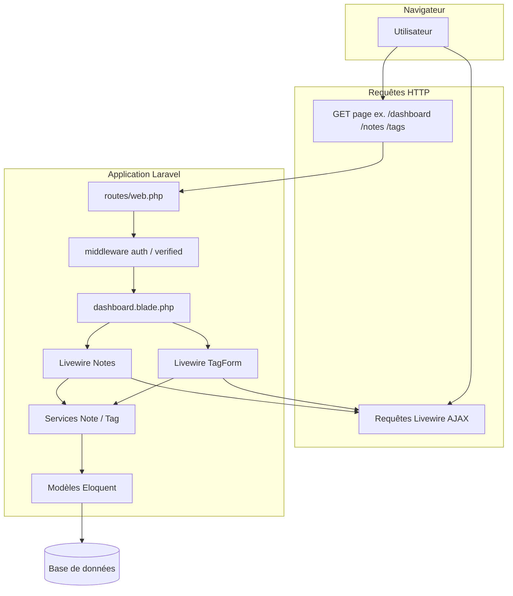

# Exercice 2 — Étape 1 : analyse de l’architecture front actuelle (couplages)

> **État du dépôt** : la migration **notes / tags** vers **React + Redux Toolkit + API** est **réalisée**. Les diagrammes ci-dessous incluent encore l’**historique Livewire** à des fins de comparaison pédagogique ; la synthèse à jour des schémas et du parcours requête figure dans **[architecture-etape4-finale.md](architecture-etape4-finale.md)**.

## Sommaire

- [Description de l’architecture cible (front)](#description-de-larchitecture-cible-front)
- [Justification de l’architecture cible (front)](#justification-de-larchitecture-cible-front)
- [1. Diagramme de composants — architecture de base (mise à jour front explicite)](#1-diagramme-de-composants--architecture-de-base-mise-à-jour-front-explicite)
- [2. Avantages et limites de l’architecture front actuelle](#2-avantages-et-limites-de-larchitecture-front-actuelle)
- [3. Écart : architecture front de base vs architecture cible (React + state management)](#3-écart--architecture-front-de-base-vs-architecture-cible-react--state-management)
- [4. Parcours d’une action utilisateur (interface → base de données)](#4-parcours-dune-action-utilisateur-interface--base-de-données)
- [5. Vues PHP générant du HTML dynamique (périmètre notes / tags)](#5-vues-php-générant-du-html-dynamique-périmètre-notes--tags)
- [6. Éléments à extraire côté client (Livewire → React)](#6-éléments-à-extraire-côté-client-livewire--react)

---

## Description de l’architecture cible (front)

L’architecture **cible** pour le périmètre notes / tags est une **application React** (bundlée avec **Vite**) qui :

- consomme **exclusivement** l’**API REST** déjà exposée par Laravel (`GET/POST/DELETE` sur `/api/notes`, `/api/tags`, login Sanctum, etc.) ;
- gère l’**état applicatif** (utilisateur, token, listes, erreurs réseau) via un **state management** global — dans ce projet, **Redux Toolkit** (voir [étape 2](architecture-front-exercice2-etape2.md)) ;
- remplace progressivement les composants **Livewire** et les vues associées par des **composants React** montés sur une page « coquille » Blade (point d’entrée unique du bundle).

La page Laravel ne sert plus de logique métier pour ces écrans : elle délivre le HTML minimal (souvent un `div` racine) et les assets ; toute interaction métier passe par **HTTP + JSON** et le **Bearer token**.

---

## Justification de l’architecture cible (front)

| Motif | Détail |
|-------|--------|
| **Alignement sur l’API back-end** | Le même contrat que les futurs clients (mobile, intégrations) évite un second canal parallèle (Livewire + session) pour la même donnée à terme. |
| **État client explicite** | Formulaires et listes ne dépendent plus du cycle Livewire serveur ; un store (RTK) documente où vit l’état et simplifie les tests et le débogage (DevTools). |
| **Évolutivité UI** | React facilite la composition d’interfaces plus riches (feedback instantané, navigation client) sans multiplier les allers-retours serveur pour chaque frappe si le besoin apparaît. |
| **Pédagogie du parcours** | Séparer **UI / API / persistance** illustre une transformation d’architecture réaliste (progressive, sans tout jeter d’un coup). |

La synthèse globale (back + front) est rappelée dans le [README](../README.md).

---

## 1. Diagramme de composants — architecture de base (mise à jour front explicite)

---

## 2. Avantages et limites de l’architecture front actuelle

### 2.1 Problèmes / couplages détectés

| Problème | Détail dans le projet |
|----------|------------------------|
| **Couplage UI ↔ serveur** | Les vues `livewire/*.blade.php` mélangent structure HTML, directives Livewire (`wire:model`, `wire:submit`, `wire:click`) et données déjà injectées par le composant PHP. |
| **Pas de contrat HTTP métier côté navigateur** pour ces écrans | Les notes/tags passent par **session web** + Livewire, pas par l’**API REST** (`/api/...`) que le client React utilisera. Deux canaux possibles pour la même donnée tant que la migration n’est pas finie. |
| **État d’interface sur le serveur** | Champs (`$text`, `$tag_id`, `$name`) et listes (`$notes`, `$tags`) vivent dans le composant Livewire : chaque interaction repasse par le serveur. |
| **Duplication conceptuelle** | La même règle métier existe côté **services** (déjà bien factorisée) et côté **validation Livewire** (`$rules`) pour l’UI actuelle ; côté React, ce sera la validation + réponses de l’API (à aligner sur les mêmes règles). |
| **Messages flash session** | `session()->flash('message', ...)` : lié au cycle requête Laravel, à remplacer par un retour d’état côté client (toast, state) en React. |

### 2.2 Situations où cette architecture reste avantageuse

- **Prototypage rapide** et **petites équipes** full-stack Laravel : peu de couches, déploiement unique.
- **Formulaires simples** avec validation serveur centralisée : Livewire garantit que la règle métier appelle déjà les **services** (refactor récent).
- **SEO ou rendu initial** : la page arrive avec une structure HTML côté serveur (même si une partie est enrichie par Livewire après coup).

---

## 3. Écart : architecture front de base vs architecture cible (React + state management)

| Aspect | Base (actuel) | Cible (exercice) |
|--------|----------------|------------------|
| Rendu principal | Serveur (Blade + fragments Livewire) | Client (**React**) |
| Données notes/tags | Livewire + services + session | **JSON** via **API REST** déjà exposée |
| État UI | Propriétés du composant Livewire | **State management** (store global / slices, selon spec du cours) |
| Auth navigateur pour ces features | Cookie session (`auth`) | **Token Bearer** (Sanctum), stockage et en-têtes gérés côté client |

### 3.1 Liste des éléments à **modifier** (au fil de la migration guidée)

| Élément | Rôle actuel | Intention cible |
|---------|-------------|-----------------|
| `routes/web.php` | `Route::view('/notes'…)`, `dashboard` | Servir une **entrée SPA** ou une vue « coquille » qui monte React au lieu d’embarquer Livewire pour notes/tags. |
| `resources/views/dashboard.blade.php` | Inclut `<livewire:notes />` et `<livewire:tag-form />` | Point de montage **React** (ex. `
`) + chargement du bundle front. |
| Layout / Vite | Livewire scripts/styles | Point d’entrée **build React** (selon consigne technique du cours). |

### 3.2 À **supprimer** ou retirer du flux (en fin de migration fonctionnelle — pas en étape 1)

| Élément | Raison |
|---------|--------|
| `app/Livewire/Notes.php`, `app/Livewire/TagForm.php` | Remplacés par composants React + appels API. |
| `resources/views/livewire/notes.blade.php`, `tag-form.blade.php` | Remplacés par JSX / templates React. |

### 3.3 À **ajouter**

| Élément | Rôle |
|---------|------|
| Arborescence **React** (pages / composants notes & tags) | UI client-driven. |
| **Client HTTP** vers `/api/*` | Login, token, CRUD notes/tags. |
| **State management** (solution imposée ou recommandée par l’énoncé) | État global ou modulaire (liste notes, tags, utilisateur, erreurs API). |
| Gestion **CORS** / URL d’API si front servi séparément | Selon spec et environnement. |

---

## 4. Parcours d’une action utilisateur (interface → base de données)

### 4.1 Ajouter une note

1. **Interface :** formulaire dans `resources/views/livewire/notes.blade.php` (`wire:submit.prevent="save"`).
2. **Composant :** `App\Livewire\Notes::save()` — validation `$rules`, puis `NoteServiceInterface::createForUser(Auth::user(), text, tag_id)`.
3. **Service :** `NoteService::createForUser` — `Note::create([...])`.
4. **BDD :** insertion table `notes`.
5. **Retour :** `loadNotes()` recharge la collection ; Livewire renvoie le HTML mis à jour ; message flash session.

### 4.2 Supprimer une note

1. **Interface :** bouton `wire:click="delete({{ $note->id }})"`.
2. **Composant :** `Notes::delete($noteId)` → `NoteServiceInterface::deleteForUser`.
3. **Service :** requête `Note` filtrée par `user_id`, `delete()`.
4. **BDD :** suppression ligne `notes`.
5. **Retour :** `loadNotes()` + réponse Livewire.

### 4.3 Ajouter un tag

1. **Interface :** `resources/views/livewire/tag-form.blade.php`, `wire:submit.prevent="save"`.
2. **Composant :** `TagForm::save()` — validation, `TagServiceInterface::create($name)`.
3. **Service :** `Tag::create`.
4. **BDD :** insertion `tags`.
5. **Événement :** `dispatch('tagCreated')` ; **Notes** écoute `refreshTags` et recharge `$tags` via `TagServiceInterface::all()`.

---

## 5. Vues PHP générant du HTML dynamique (périmètre notes / tags)

| Fichier | Contenu dynamique |
|---------|-------------------|
| `resources/views/dashboard.blade.php` | Assemble le layout et **insère** les deux composants Livewire (zone dashboard). |
| `resources/views/livewire/notes.blade.php` | `@if` message session, `@foreach ($notes)`, options `@foreach ($tags)`, boutons `wire:click`. |
| `resources/views/livewire/tag-form.blade.php` | Message session, `@error('name')`, formulaire lié au state Livewire. |

---

## 6. Éléments à extraire côté client (Livewire → React)

| Côté Livewire / Blade aujourd’hui | Côté React demain (logique d’interface, pas la règle métier serveur) |
|----------------------------------|----------------------------------------------------------------------|
| État des champs (`text`, `tag_id`, `name`) | State local ou store (selon choix state management). |
| Liste des notes et tags affichées | Données issues de **`GET /api/notes`**, **`GET /api/tags`** (et relations dans le JSON). |
| Soumission formulaire note / tag | **`POST /api/notes`**, **`POST /api/tags`** avec corps JSON. |
| Suppression note | **`DELETE /api/notes/{id}`**. |
| Rafraîchissement tags après création | Après succès `POST /api/tags`, **dispatch d’action** store / re-fetch tags (équivalent de `tagCreated`). |
| Messages succès / erreurs | État UI (notifications) à partir des réponses HTTP (et corps d’erreur `422`). |
| Authentification pour l’API | **`POST /api/login`**, conservation du **Bearer token**, en-tête sur les requêtes suivantes. |

---

**Étape suivante (conception state management)** : [architecture-front-exercice2-etape2.md](architecture-front-exercice2-etape2.md)

---
