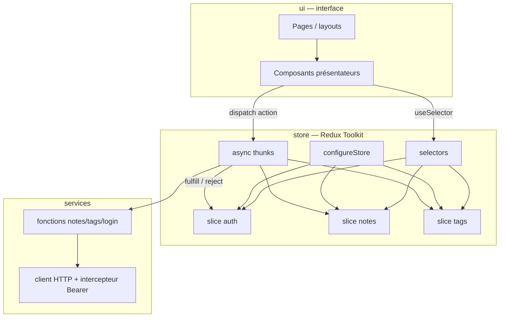
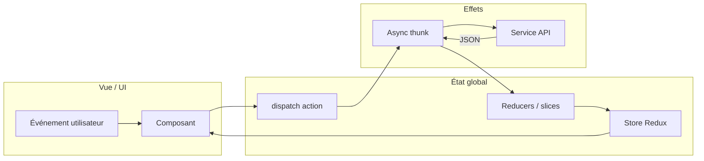
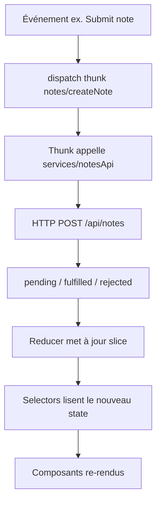

# Exercice 2 — Étape 2 : architecture front avec state management

Ce document détaille la **couche d’état** de l’**architecture front cible** (Redux Toolkit + thunks). Pour la vision d’ensemble (React, API, monolithe Laravel), voir le [README](../README.md) et l’[étape 1](architecture-front-exercice2-etape1.md).

## Sommaire

- [Architecture cible : rôle du state management (justification)](#architecture-cible--rôle-du-state-management-justification)
- [1. Choix de la solution de state management](#1-choix-de-la-solution-de-state-management)
- [2. Pattern de conception associé : Flux (Redux)](#2-pattern-de-conception-associé--flux-redux)
- [3. Schéma d’organisation front-end (avec Redux Toolkit)](#3-schéma-dorganisation-front-end-avec-redux-toolkit)
- [4. Flux d’information : UI → état → effets](#4-flux-dinformation-ui--état--effets)
- [5. Règles de conception (rappel consigne)](#5-règles-de-conception-rappel-consigne)

---

## Architecture cible : rôle du state management (justification)

Dans l’architecture cible globale, **Redux Toolkit** n’est pas une fin en soi : il matérialise le pattern **Flux** attendu par l’énoncé — **flux unidirectionnel**, effets réseau hors des composants présentateurs, **une source de vérité** pour notes, tags, session et erreurs API.

**Pourquoi c’est cohérent avec la cible**

- Les données métier viennent de l’**API** (pas du state interne Livewire) : les **async thunks** sont l’endroit naturel pour `POST /api/login`, `GET /api/notes`, etc., puis pour mettre à jour le store.
- **Découplage** : les écrans React se contentent d’afficher et de dispatcher des actions ; les règles de rafraîchissement après mutation restent centralisées (équivalent propre aux `dispatch` / rechargements Livewire).
- **Traçabilité** : même parcours utilisateur reproductible en développement (Redux DevTools), utile pour un rapport de transformation d’architecture.

---

## 1. Choix de la solution de state management

**Solution retenue : Redux Toolkit (RTK)**

| Critère | Pourquoi RTK ici |
|---------|------------------|
| Alignement pédagogique | Pattern **Flux** (actions → traitement → store → vue) explicitement attendu dans la consigne ; RTK est la forme **standard et maintenue** de Redux aujourd’hui. |
| Simplicité relative | Moins de code « Redux classique » (slices `createSlice`, thunks intégrés) tout en gardant **un seul store** bien coordonné. |
| Périmètre projet | CRUD notes/tags + auth token : quelques **slices** (`auth`, `notes`, `tags`) suffisent, sans réinventer la roue. |

---

## 2. Pattern de conception associé : Flux (Redux)

- **Principe** : flux de données **unidirectionnel**. L’UI **déclenche** des intentions (actions), le **store** est mis à jour par des **reducers** purs (ou logique encapsulée dans le slice), l’UI **s’abonne** au store (**selectors** / `useSelector`) et se re-rend.
- **Effets de bord** (appels API, stockage token) : centralisés dans **async thunks** (`createAsyncThunk`) ou middleware, **pas** dans les composants d’affichage.

**Avantages pour ce projet**

| Avantage | Application concrète |
|----------|----------------------|
| **Une seule source de vérité** | Liste des notes, tags, utilisateur connecté et erreurs API au même endroit. |
| **Prévisibilité** | Même action → même transition d’état ; facile à expliquer dans le rapport. |
| **Découplage UI / API** | Composants « présentateurs » reçoivent des props ; conteneurs ou hooks minces connectent `dispatch` / `useSelector`. |
| **Centralisation des effets** | Thunks + module `services/api` : un seul endroit pour Bearer, URLs, gestion d’erreur HTTP. |
| **Évite la duplication** | Données dérivées via **selectors** (ex. notes triées, tag par id) au lieu de recopier l’état dans plusieurs composants. |
| **Outils** | Redux DevTools utile pour déboguer les flux login / notes pendant le développement. |

---

## 3. Schéma d’organisation front-end (avec Redux Toolkit)



**Organisation des fichiers**

```text
resources/js/                    # ou frontend/src/ selon le projet
├── app/
│   └── store.ts                 # configureStore, root reducer
├── features/
│   ├── auth/
│   │   ├── authSlice.ts
│   │   └── authThunks.ts        # login, logout, restore session
│   ├── notes/
│   │   ├── notesSlice.ts
│   │   ├── notesThunks.ts
│   │   └── notesSelectors.ts
│   └── tags/
│       ├── tagsSlice.ts
│       ├── tagsThunks.ts
│       └── tagsSelectors.ts
├── services/
│   ├── apiClient.ts             # fetch/axios, baseURL, Authorization
│   └── endpoints.ts             # appels login, notes, tags (sans JSX)
└── ui/
    ├── pages/
    │   ├── NotesPage.tsx
    │   └── TagsPage.tsx
    └── components/
        ├── NoteList.tsx
        ├── NoteForm.tsx
        └── TagForm.tsx
```

---

## 4. Flux d’information : UI → état → effets





---

## 5. Règles de conception (rappel consigne)

| À faire | À éviter |
|---------|----------|
| Appels API dans **`services/`** + invocation depuis **thunks** | `fetch` direct dans un composant « dumb » |
| Données partagées via **store + selectors** | Copier la même liste en `useState` local et dans le store |
| **Un store** RTK avec slices coordonnés | Plusieurs stores Redux non connectés |
| Composants UI **stupides** quand c’est possible | Mélanger gros morceaux de logique métier dans le JSX |

**Cache** : pour ce périmètre, l’état serveur est surtout dans le **store** (liste notes/tags) ; pas besoin d’un second cache complexe tant que les thunks **réconcilient** l’état après chaque mutation. Si le cours impose **RTK Query**, on pourrait documenter le cache côté `api` du slice — à aligner sur la spec technique.

